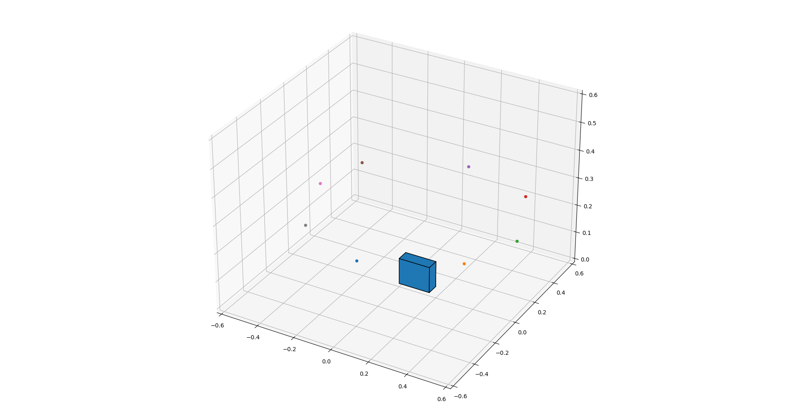
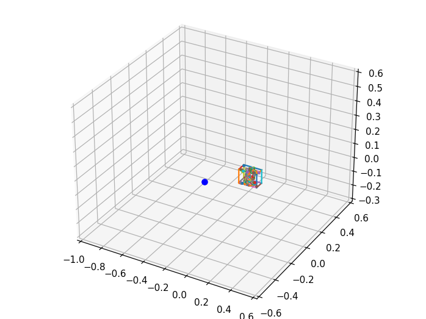
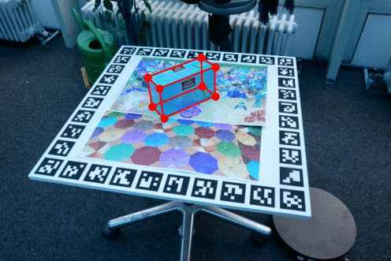

# Pose_Estimation

The repo consists of the python notebooks and python code used for the project on pose estimation as a part of my praktikum on "Tracking and Detection in Computer Vision".

# Task 1
For a caliberated camera, I estimated the pose of the teabox (object) using PnP algorithm and extracted the SIFT keypoints. I implemented ray box intersection algorithm 
to back project the 2D SIFT features onto the 3D model. These 2D-3D correspondeces will be used for the automatic object detection and pose estimation in the later tasks.
The results of task 1 are as shown below.

The points in the figure below represents the optical centers of the cameras at different positions.
<h2 align = "center">
  
 </h2>
 
 The below figure shows the keypoints on a surface of the object as seen from the camera represented by a blue dot.
 <h2 align = "center">
  
 </h2>
 
 # Task 2
 4 data points are sampled and RANSAC algorithm is applied to consider only the inliers.Following is one of the result after applying RANSAC to the SIFT keypoints detected.
 <h2 align = "center">
  
 </h2>
 
 # Task 3
 Pose refinement with non-linear optimization is done. Following is the short gif of the result after applying non-linear optimization.
 <h2 align = "center">
  
 </h2>
 
